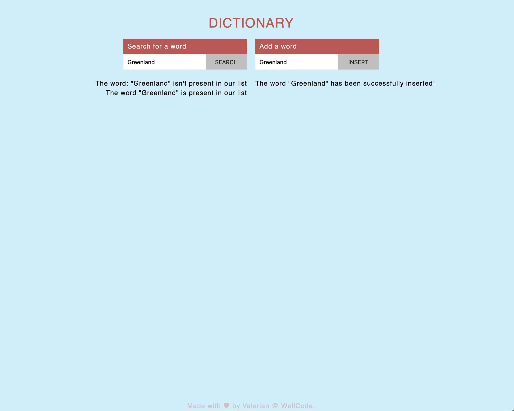

# Hidden Button

<figure style="text-align: center;">
    <picture>
        
    </picture>
    <figcaption>Screen shot of the app showing the two forms 
for sarching and adding a word in the dictionary</figcaption>
</figure>

## Description

A practice web app that implements adding a word in a dictionary and the 
posibility to search for a certain word in it.
The sole pourpose of this app is to learn by doing it!

## How to run

To run the application, download all the files to your local machine and 
open the "index.html" file in your favorite web browser.

## Usage

The user is greeted with two forms:
<ul>
	<li> One for searching a word in the dictionary.</li>
		<li> At every search the user is promted with the 
result</li> 
of the search. The word either it is or not in the dictionary.</li>
	<li> One for adding a word in the dictionary.</li>

Enjoy!

##

The content of this repository is licensed under a [Creative Commons 
Attribution License.](https://creativecommons.org/licenses/by/4.0/deed.en)

